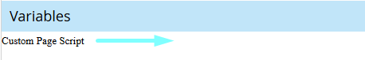

# Interactive Tools --- iframe Integration Framework

A reusable, cross-platform system for embedding React-based interactive
tools (ROI calculators, surveys, Q&A flows, and assessments) into
**Marketo Guided Landing Pages** and **Sitecore web pages** using
iframes and a lightweight postMessage resizing script.

------------------------------------------------------------------------

## 🚀 Why this exists

Originally, these tools were built as **Marketo snippets**, which meant:

-   They worked only inside Marketo
-   They could not be reused on the corporate website
-   Maintenance was fragmented
-   UX was inconsistent

To solve this, all tools were:

-   Rebuilt in **React**
-   Stored in **GitHub**
-   Hosted on a company domain
-   Designed to be embedded anywhere via **iframe + script**

This makes them truly reusable across platforms.

------------------------------------------------------------------------

## 🏗️ High-Level Architecture

    React Tool (hosted on https://value.blueyonder.com/)
                    ↓
    iframe embedded in Marketo or Sitecore
                    ↓
    postMessage script listens for height updates
                    ↓
    Parent page resizes iframe dynamically

This ensures:

-   Responsive behavior
-   No scrollbars
-   Mobile-friendly experience
-   Cross-domain communication

------------------------------------------------------------------------

## 🌐 Tools Hub (Live Reference Page)

All tools can be previewed and tested here before embedding:

   [🔗 Value Tools Demo Page](https://now.blueyonder.com/value-tools-guide.html) 

Use this page for validation, demos, and QA. 
 

------------------------------------------------------------------------

## 📌 How to embed in Marketo Guided Landing Pages

### Step 1 --- Add the iframe

Paste this into the section where you want the tool to appear.

#### ROI Calculator iframe

``` html
<iframe 
  src="https://company.tools.com/roi-calculator" 
  width="100%" 
  frameborder="0"
  scrolling="no"
  id="roiToolFrame">
</iframe>
```

------------------------------------------------------------------------

### Step 2 --- Add the script

In Marketo Page Editor, click on **Custom Page Script** variable and paste:<br>


``` html
<script src=""></script>
```

------------------------------------------------------------------------

## 📚 iframe + Script Library
Each tool below includes copy‑paste ready iframe and script blocks.

### 1. Returns Management (ROI Calculator)

**iframe**
``` html
 <iframe 
    id="returns-management"
    src="https://value.blueyonder.com/returns-management?embed=true"
    style="width: 100%; border: none; display: block;"
    title="returns-management"
  ></iframe>
```

**Script (Custom Page Script)**
``` html
<script src=""></script>
```
------------------------------------------------------------------------

### 2. Supply Chain (ROI Calculator)

**iframe**
``` html
  <iframe 
    id="supply-chain"
    src="https://value.blueyonder.com/supply-chain?embed=true"
    style="width: 100%; border: none; display: block;"
    title="supply-chain"
  ></iframe> 
```

**Script (Custom Page Script)**
``` html
<script src=""></script>
```
------------------------------------------------------------------------

### 3. Demand and supply planning (ROI Calculator)

**iframe**
``` html
  <iframe 
    id="demand-and-supply-planning"
    src="https://value.blueyonder.com/demand-and-supply-planning?embed=true"
    style="width: 100%; border: none; display: block;"
    title="demand-and-supply-planning"
  ></iframe> 
```

**Script (Custom Page Script)**
``` html
<script src=""></script>
```
------------------------------------------------------------------------

### 4. Auto Campaign Checklist

**iframe**
``` html
  <iframe 
    id="auto-campaign-checklist"
    src="https://value.blueyonder.com/auto-campaign-checklist?embed=true"
    style="width: 100%; border: none; display: block;"
    title="auto-campaign-checklist"
  ></iframe> 
```

**Script (Custom Page Script)**
``` html
<script src=""></script>
```
------------------------------------------------------------------------

### 5. Business case for sustainability

**iframe**
``` html
  <iframe 
    id="business-case-for-sustainability"
    src="https://value.blueyonder.com/business-case-for-sustainability?embed=true"
    style="width: 100%; border: none; display: block;"
    title="business-case-for-sustainability"
  ></iframe> 
```

**Script (Custom Page Script)**
``` html
<script src=""></script>
```
------------------------------------------------------------------------

<!-- ------------------------------------------------------------------------
> Important: Each iframe needs a unique ID, and the same ID must be used
> inside the script.
------------------------------------------------------------------------ -->

## 🧩 Using in Sitecore

You can embed the same iframe inside:

-   Rich Text field\
-   Custom HTML component\
-   Page-level script block

No changes are required compared to Marketo.

------------------------------------------------------------------------

## ✅ Benefits

-   Works everywhere\
-   Centralized maintenance\
-   Faster updates\
-   Consistent UX\
-   Better performance\
-   Easier analytics tracking

------------------------------------------------------------------------

## 🛠️ Troubleshooting

### iframe does not resize

Check that:

-   iframe ID matches the script\
-   Script is added in **Custom Page Script**\
-   URL is `https://company.tools.com`

### Tool does not load

-   Ensure HTTPS\
-   Check cross-origin permissions\
-   Disable ad blockers

------------------------------------------------------------------------

## 🔮 Roadmap

-   Single universal script for all tools\
-   Built-in analytics events\
-   Marketo cookie sync\
-   Progressive profiling support

------------------------------------------------------------------------

## 👥 Maintainers

-   **Madhav -- Frontend / Marketo Templates**\
-   **Web Engineering Team -- React & Hosting**
